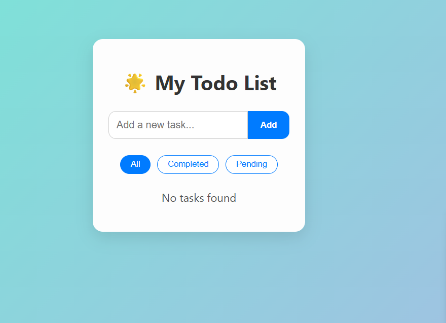
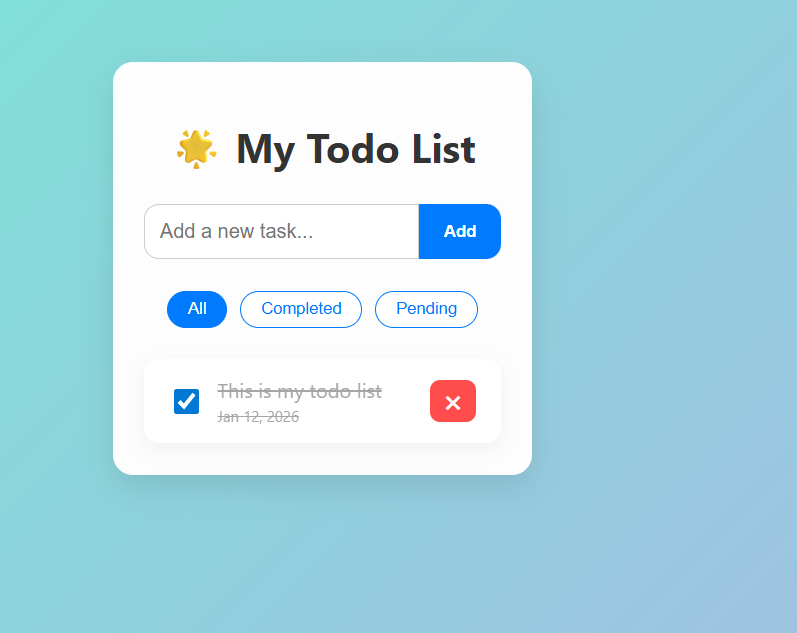

# Todo App

A modern, full-stack task management application that helps users organize their daily tasks with an intuitive and responsive interface.

   

## 🚀 Live Demo

- **Frontend**: [https://todo-app-mu-two-88.vercel.app/](https://todo-app-mu-two-88.vercel.app/)
- **Backend API**: Deployed on Render

## 📸 Screenshots




## 📋 Table of Contents

- [Overview](#overview)
- [Features](#features)
- [Tech Stack](#tech-stack)
- [Getting Started](#getting-started)
- [Installation](#installation)
- [Environment Variables](#environment-variables)
- [Usage](#usage)
- [API Endpoints](#api-endpoints)
- [Deployment](#deployment)
- [Learning Points](#learning-points)
- [Roadmap](#roadmap)
- [Contributing](#contributing)
- [License](#license)

## 🎯 Overview

Todo App is a full-stack web application designed to provide users with an easy and intuitive way to manage their daily tasks. Users can add, edit, delete, and organize tasks while enjoying persistent storage through MongoDB integration. The application features a clean, responsive UI and is deployed live with frontend on Vercel and backend on Render.

## ✨ Features

- **Add Tasks**: Create new tasks with a title
- **Edit Tasks**: Double-click on any task to edit its name
- **Task Status**: Mark tasks as completed or pending with a single click
- **Delete Tasks**: Remove tasks individually when no longer needed
- **Smart Filtering**: View all tasks, or filter by completed or pending status
- **Persistent Storage**: All tasks are automatically saved to MongoDB database
- **Responsive Design**: Fully optimized for desktop, tablet, and mobile devices
- **Live Deployment**: Access your tasks from anywhere with our live deployment

## 🛠️ Tech Stack

### Frontend
- **React 19**: Modern UI library for building interactive interfaces
- **Vite**: Next-generation frontend tooling for fast development
- **Axios**: Promise-based HTTP client for API requests
- **CSS3**: Custom styling for responsive design

### Backend
- **Node.js**: JavaScript runtime environment
- **Express.js**: Fast, unopinionated web framework
- **MongoDB**: NoSQL database for flexible data storage
- **Mongoose**: Elegant MongoDB object modeling
- **CORS**: Cross-Origin Resource Sharing middleware

### Deployment
- **Vercel**: Frontend hosting with automatic builds
- **Render**: Backend API hosting with continuous deployment

## 🏁 Getting Started

### Prerequisites

Before running this project, ensure you have the following installed:

- Node.js (v16 or higher)
- npm or yarn
- MongoDB account (or local MongoDB installation)
- Git

## 📦 Installation

### Clone the Repository

```bash
git clone https://github.com/praveen24lingam/todo-app.git
cd todo-app
```

### Frontend Setup

```bash
cd frontend
npm install
```

### Backend Setup

```bash
cd backend
npm install
```

## 🔐 Environment Variables

### Backend (.env)

Create a `.env` file in the backend directory:

```env
MONGODB_URI=your_mongodb_connection_string
PORT=5000
```

### Frontend (.env)

Create a `.env` file in the frontend directory:

```env
VITE_API_BASE_URL=http://localhost:5000/api
```

For production, update `VITE_API_BASE_URL` to your Render backend URL.

## 💻 Usage

### Running Locally

#### Start Backend Server

```bash
cd backend
npm run dev
```

The backend will run on `http://localhost:5000`

#### Start Frontend Development Server

```bash
cd frontend
npm run dev
```

The frontend will run on `http://localhost:5173`

### Building for Production

#### Frontend

```bash
cd frontend
npm run build
```

#### Backend

The backend doesn't require a build step. Simply ensure all dependencies are installed before deployment.

## 🔌 API Endpoints

| Method | Endpoint | Description |
|--------|----------|-------------|
| GET | `/api/todos` | Fetch all tasks |
| POST | `/api/todos` | Create a new task |
| PUT | `/api/todos/:id` | Update an existing task |
| DELETE | `/api/todos/:id` | Delete a task |

### Example API Request

```javascript
// Create a new task
axios.post('http://localhost:5000/api/todos', {
  title: 'Complete project documentation',
  completed: false
});
```

## 🚢 Deployment

### Frontend Deployment (Vercel)

1. Push your code to GitHub
2. Import your repository on Vercel
3. Set environment variable: `VITE_API_BASE_URL`
4. Deploy with automatic builds on push

### Backend Deployment (Render)

1. Push your code to GitHub
2. Create a new Web Service on Render
3. Connect your repository
4. Set environment variables: `MONGODB_URI`, `PORT`
5. Deploy and get your live backend URL

## 📚 Learning Points

This project demonstrates several important full-stack development concepts:

- Building a complete CRUD application from scratch
- Connecting React frontend with Express backend
- Managing asynchronous operations with Axios and async/await
- Implementing RESTful API design principles
- Environment variable management across different environments
- State management in React using hooks (useState, useEffect)
- Deploying frontend and backend to separate hosting platforms
- Database integration with MongoDB and Mongoose ODM

## 🗺️ Roadmap

Future enhancements planned for this project:

- [ ] User authentication (signup/login with JWT)
- [ ] Dark mode toggle
- [ ] Task categories and tags
- [ ] Due dates and reminders
- [ ] Push notifications for upcoming tasks
- [ ] Drag-and-drop task reordering
- [ ] Priority levels for tasks
- [ ] Search and advanced filtering
- [ ] Task sharing and collaboration
- [ ] Export tasks to CSV/PDF

## 🤝 Contributing

Contributions are welcome! Please follow these steps:

1. Fork the repository
2. Create a new branch (`git checkout -b feature/amazing-feature`)
3. Commit your changes (`git commit -m 'Add some amazing feature'`)
4. Push to the branch (`git push origin feature/amazing-feature`)
5. Open a Pull Request

## 📄 License

This project is licensed under the MIT License - see the [LICENSE](LICENSE) file for details.

## 👤 Author

**Praveen Lingam**
- GitHub: [@praveen24lingam](https://github.com/praveen24lingam)
- LinkedIn: [Praveen Lingam](https://www.linkedin.com/in/praveen-lingam24/)
- Live Project: [Todo App](https://todo-app-mu-two-88.vercel.app/)

## 🙏 Acknowledgments

- React team for the amazing library
- MongoDB for the flexible database solution
- Vercel and Render for seamless deployment platforms

---

⭐ If you found this project helpful, please consider giving it a star on GitHub!